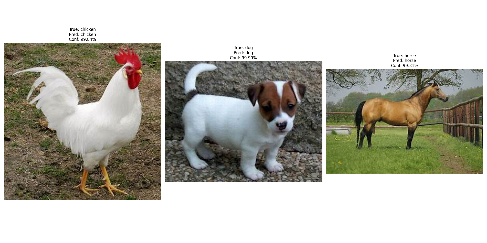
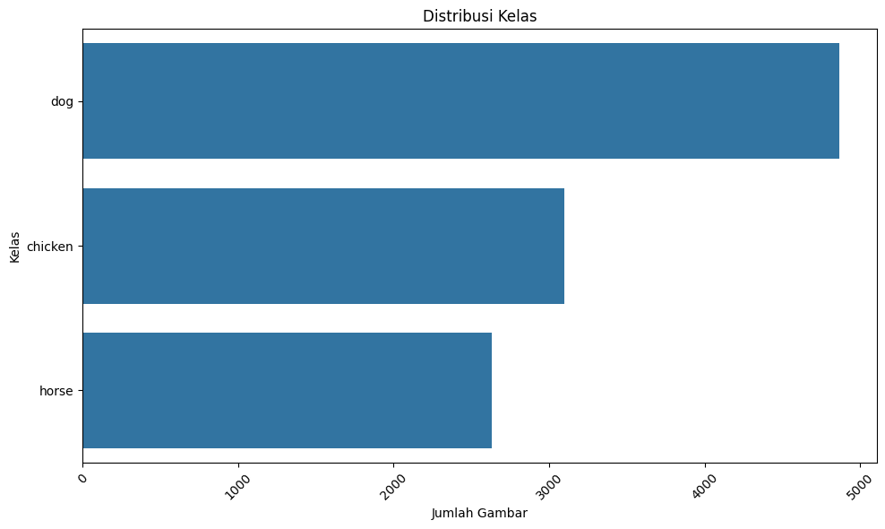
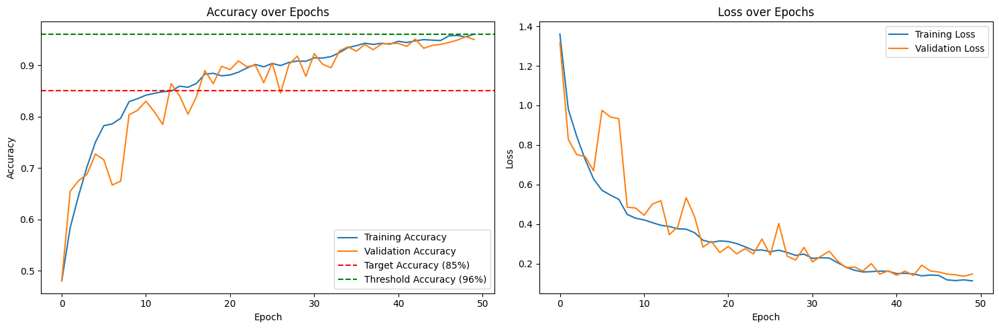
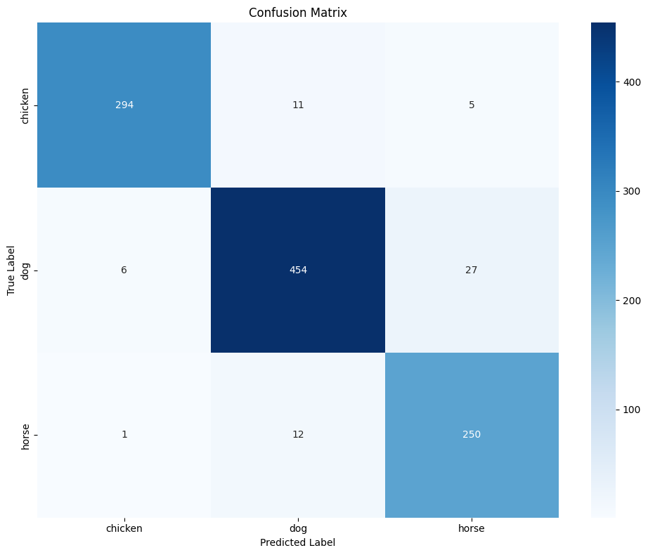

# Image Classification Project: Chicken, Dog, and Horse Classification

  
_Contoh hasil inferensi model pada gambar test_

## 📝 Deskripsi Proyek

Proyek ini bertujuan untuk membangun model CNN (Convolutional Neural Network) untuk mengklasifikasikan gambar hewan ke dalam 3 kelas: **ayam (chicken)**, **anjing (dog)**, dan **kuda (horse)**. Model mencapai akurasi **>96%** pada data test dengan menggunakan teknik augmentasi data dan optimasi arsitektur CNN. Proyek ini dapat dijalankan baik di Google Colab (direkomendasikan) maupun di localhost.

## 🛠 Teknologi & Library

- Python 3.10
- TensorFlow/Keras
- OpenCV
- Pandas/NumPy
- Matplotlib/Seaborn
- Scikit-learn

📋 **Requirements**: [requirements.txt](requirements.txt)

## 🗂 Struktur Dataset

Dataset berasal dari [Animals-10](https://www.kaggle.com/datasets/viratkothari/animal10) dengan karakteristik:

- 3 kelas terpilih: `chicken`, `dog`, `horse`
- Resolusi gambar **tidak seragam** (memenuhi kriteria proyek)
- Split dataset:
  - Training: 80%
  - Validation: 10%
  - Test: 10%

Contoh distribusi data:


## 🧠 Arsitektur Model

Model CNN dengan 5 blok konvolusi + 3 layer fully connected:

```python
model = Sequential([
    Conv2D(64, (3,3), activation='relu', ...),
    BatchNormalization(),
    # ... (detail layer ada di kode)
    Dense(3, activation='softmax')
])
```

## 🚀 Pelatihan Model

Strategi pelatihan:

- **Data Augmentation**: Rotasi, zoom, flip horizontal, adjust brightness
- **Callbacks**:
  - Early Stopping (patience=10)
  - ReduceLROnPlateau
  - Accuracy Threshold (stop jika akurasi >96%)
- Optimizer: Adam (lr=0.001)

Hasil pelatihan:


Confusion Matrix:  


## 💾 Konversi Model

Model tersedia dalam 3 format:

1. **TensorFlow SavedModel** (`/saved_model`)
2. **TensorFlow.js** (`/tfjs_model`)
3. **TensorFlow Lite** (`/tflite/model.tflite` + label.txt)

## 🖥 Cara Menggunakan

### Opsi 1: Google Colab (Direkomendasikan)

Ada dua cara untuk menggunakan notebook di Google Colab:

#### Metode 1: Langsung dari GitHub

1. Klik link notebook berikut:

   - [Template_Submission_Akhir.ipynb](https://colab.research.google.com/github/zidanmubarak/Animal-Image-Classification/blob/main/Template_Submission_Akhir.ipynb)

2. Klik tombol "Open in Colab" yang muncul di notebook
3. Simpan copy notebook ke Google Drive Anda dengan klik "File > Save a copy in Drive"
4. Mount Google Drive:

```python
from google.colab import drive
drive.mount('/content/drive')
```

5. Install requirements:

```python
!pip install -r requirements.txt
```

#### Metode 2: Melalui Google Drive

1. Download repository ini sebagai ZIP
2. Extract file ZIP
3. Upload file-file berikut ke Google Drive Anda:
   - `Template_Submission_Akhir.ipynb`
   - `requirements.txt`
4. Buka file notebook dengan klik kanan > "Open with" > Google Colaboratory
5. Install requirements:

```python
!pip install -r requirements.txt
```

#### Langkah Selanjutnya (untuk kedua metode):

1. Pilih Runtime > Change runtime type > GPU
2. Jalankan semua cell secara berurutan
3. Model yang sudah dilatih akan otomatis tersimpan di Google Drive

### Opsi 2: Localhost

1. Clone repository:

```bash
git clone https://github.com/zidanmubarak/Animal-Image-Classification.git
cd Animal-Image-Classification
```

2. Buat virtual environment (opsional tapi direkomendasikan):

```bash
python -m venv venv
# Windows
venv\Scripts\activate
# Linux/Mac
source venv/bin/activate
```

3. Install requirements:

```bash
pip install -r requirements.txt
```

4. Jalankan notebook:
   - Buka file `Template_Submission_Akhir.ipynb` di Jupyter Notebook/Lab
   - Pastikan GPU tersedia jika ingin pelatihan lebih cepat
   - Jalankan semua sel secara berurutan

## 📊 Hasil dan Evaluasi

- Akurasi model: >96%
- Waktu pelatihan:
  - ~30 menit (dengan GPU)
  - ~2-3 jam (tanpa GPU)
- Model size: ~50MB (format TFLite)